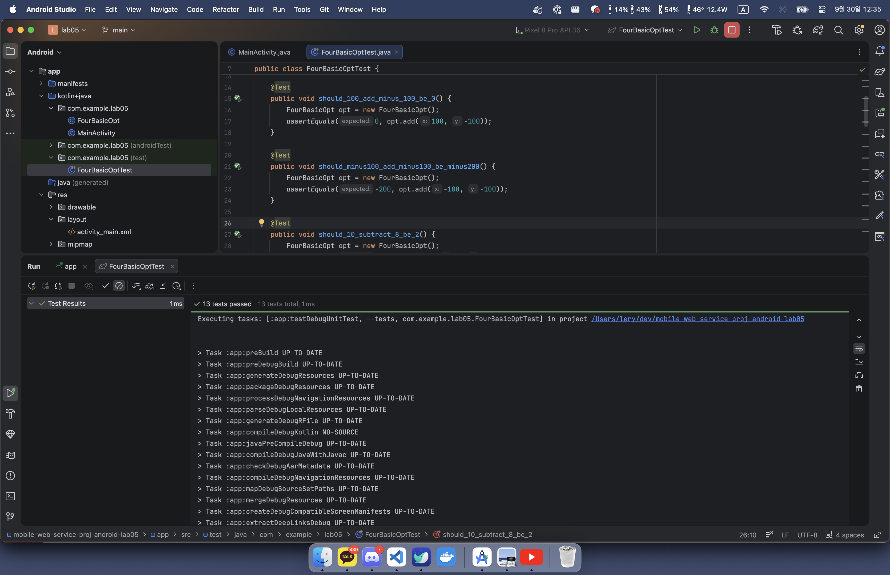
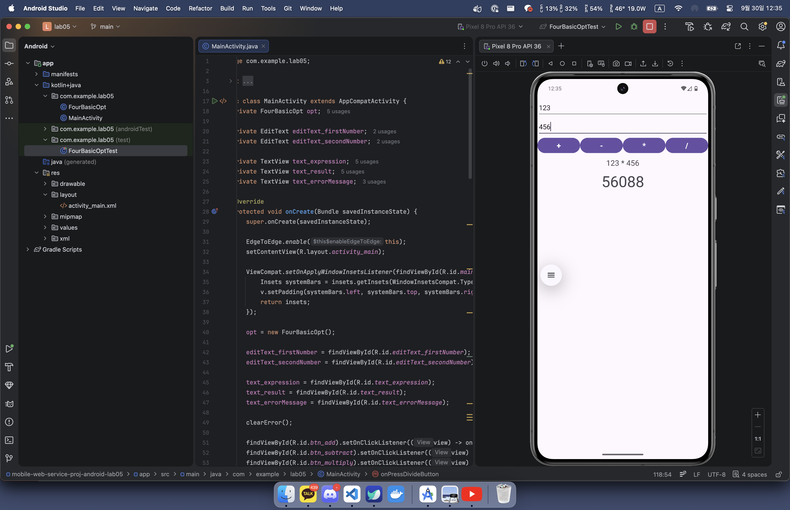

# mobile-web-service-proj-android-lab05

2026-2에 수강한 모바일웹서비스프로젝트 강의의 lab05 과제를 담은 레포지토리입니다.

## 과제 상세

TDD 기반으로 테스트 코드를 작성한 후 콘솔 텍스트를 캡처하였습니다. ([이미지 원본](./img/01-test-result.png))

사칙연산을 수행하는 안드로이드 앱을 구현하고, 가상 머신에서 구동하는 화면을 캡처하였습니다. ([이미지 원본](./img/02-running-calculator.png))
